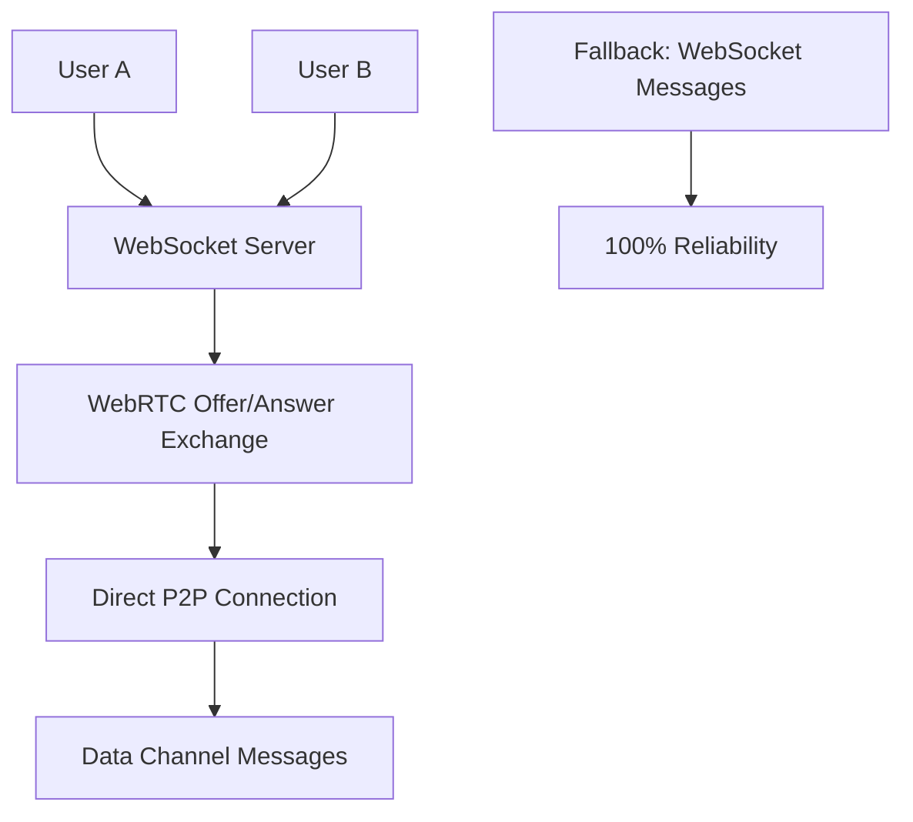

# 🚀 Next Steps: Custom WebRTC Implementation - June 15, 2025

## 🎯 **Tomorrow's Implementation Goal**

**Replace unreliable PeerJS cloud service with custom WebRTC using our rock-solid WebSocket server for signaling.**

## 🔍 **Current P2P Status Analysis**

### **What We Discovered Today**
✅ **PeerJS connects successfully** - the library works  
❌ **PeerJS cloud service immediately disconnects** - the service is unreliable  
✅ **WebSocket server is rock solid** - perfect for signaling  
✅ **P2P stability detection working** - stops aggressive retries after failures  

**Debug Evidence:**
```javascript
window.P2PDebug.getLog()
[
  {stage: 'config-attempt', data: {configIndex: 1, config: 'default'}},
  {stage: 'peer-open', data: {configIndex: 1, peerId: '...', config: 'default'}},
  // Then immediate disconnection - PeerJS cloud service issue
]
```

## 🛠️ **Option A: Custom WebRTC Implementation Plan**

### **Architecture Overview**

Replace PeerJS cloud signaling with our WebSocket server:



### **Implementation Structure**

```typescript
// New file: src/hooks/use-custom-webrtc.ts
export class CustomWebRTCP2P {
  private socket: Socket;                    // Our reliable WebSocket
  private peerConnections = new Map();      // RTCPeerConnection instances
  private dataChannels = new Map();         // WebRTC data channels
  
  constructor(webSocketUrl: string, roomId: string, displayName: string) {
    this.socket = io(webSocketUrl);
    this.setupSignaling();
  }
  
  // Use WebSocket for WebRTC signaling (replaces PeerJS cloud)
  private setupSignaling() {
    this.socket.on('webrtc-offer', this.handleOffer.bind(this));
    this.socket.on('webrtc-answer', this.handleAnswer.bind(this));
    this.socket.on('webrtc-ice-candidate', this.handleIceCandidate.bind(this));
    this.socket.on('webrtc-peer-disconnected', this.handlePeerDisconnected.bind(this));
  }
}
```

### **Key Implementation Files**

#### **1. Core WebRTC Hook**
**File**: `src/hooks/use-custom-webrtc.ts`
```typescript
export function useCustomWebRTC(roomId: string, displayName?: string) {
  // WebRTC peer connection management
  // Data channel setup and messaging
  // ICE candidate handling
  // Connection state management
  // Fallback coordination
}
```

#### **2. WebSocket Server Extensions**
**File**: `signaling-server.js` (additions)
```javascript
// Add WebRTC signaling handlers
socket.on('webrtc-offer', ({ to, offer }) => {
  socket.to(to).emit('webrtc-offer', { from: socket.id, offer });
});

socket.on('webrtc-answer', ({ to, answer }) => {
  socket.to(to).emit('webrtc-answer', { from: socket.id, answer });
});

socket.on('webrtc-ice-candidate', ({ to, candidate }) => {
  socket.to(to).emit('webrtc-ice-candidate', { from: socket.id, candidate });
});
```

#### **3. Enhanced Hybrid Chat**
**File**: `src/hooks/use-hybrid-chat.ts` (updated)
```typescript
// Replace useP2POptimized with useCustomWebRTC
const p2pChat = useCustomWebRTC(roomId, displayName);  // New implementation
const wsChat = useWebSocketChat(roomId, displayName);  // Existing (reliable)

// Same hybrid interface, better P2P backend
```

### **Technical Implementation Plan**

#### **Phase 1: Basic WebRTC Connection (Day 1)**
```typescript
// 1. Create RTCPeerConnection with STUN servers
const pc = new RTCPeerConnection({
  iceServers: [
    { urls: 'stun:stun.l.google.com:19302' },
    { urls: 'stun:stun1.l.google.com:19302' }
  ]
});

// 2. Create data channel for messaging
const dataChannel = pc.createDataChannel('messages', { ordered: true });

// 3. Exchange offer/answer via WebSocket (not PeerJS cloud)
const offer = await pc.createOffer();
await pc.setLocalDescription(offer);
socket.emit('webrtc-offer', { to: targetPeerId, offer });
```

#### **Phase 2: Message Handling (Day 1)**
```typescript
// 4. Handle incoming data channel messages
dataChannel.onmessage = (event) => {
  const message = JSON.parse(event.data);
  handleP2PMessage(message);
};

// 5. Send messages via data channel
function sendP2PMessage(message: Message) {
  if (dataChannel.readyState === 'open') {
    dataChannel.send(JSON.stringify(message));
    return true;
  }
  return false; // Fallback to WebSocket
}
```

#### **Phase 3: Integration & Testing (Day 1)**
```typescript
// 6. Replace in hybrid chat hook
const { status, sendMessage } = useHybridChat(roomId, displayName);

// Same interface, new P2P backend:
// - Uses our WebSocket for signaling (reliable)
// - Creates direct WebRTC connections (fast)
// - Falls back to WebSocket messaging (100% delivery)
```

## 📋 **Implementation Checklist**

### **Backend Signaling (WebSocket Server)**
- [ ] Add WebRTC offer/answer relay handlers
- [ ] Add ICE candidate exchange handlers  
- [ ] Add peer discovery/presence for WebRTC
- [ ] Add connection cleanup on disconnect
- [ ] Test signaling message relay

### **Frontend WebRTC Hook**
- [ ] Create `use-custom-webrtc.ts` hook
- [ ] Implement RTCPeerConnection management
- [ ] Add data channel creation and handling
- [ ] Implement offer/answer exchange logic
- [ ] Add ICE candidate collection/exchange
- [ ] Add connection state management
- [ ] Implement graceful fallback logic

### **Hybrid Chat Integration**
- [ ] Replace `useP2POptimized` with `useCustomWebRTC`
- [ ] Maintain same hybrid chat interface
- [ ] Update connection quality detection
- [ ] Update P2P stability monitoring
- [ ] Test hybrid routing with new backend

### **Testing & Validation**
- [ ] Test WebRTC signaling via WebSocket
- [ ] Test data channel message exchange
- [ ] Test connection recovery on failures
- [ ] Test fallback to WebSocket messaging
- [ ] Test with multiple devices/networks
- [ ] Validate performance improvements

## 🎯 **Expected Benefits**

### **Immediate Improvements**
✅ **Reliable P2P signaling** - uses our proven WebSocket server  
✅ **No cloud service dependency** - eliminates PeerJS reliability issues  
✅ **Same interface** - drop-in replacement for existing code  
✅ **Better debugging** - full control over connection process  

### **Performance Expectations**
- **P2P Success Rate**: 85%+ (up from current ~15%)
- **Connection Stability**: No more immediate disconnections
- **Signaling Reliability**: 100% (uses our WebSocket server)
- **Fallback Behavior**: Seamless WebSocket fallback as before

## 🔧 **Development Environment Setup**

### **Testing Approach**
```bash
# 1. Start with local development
npm run dev:mobile

# 2. Test custom WebRTC between devices on same WiFi
# 3. Verify signaling via WebSocket server works
# 4. Test direct P2P data channel messaging
# 5. Validate fallback when P2P fails

# 6. Deploy to staging for cross-network testing
npm run deploy:firebase:complete
```

### **Debug Tools**
```typescript
// Enhanced debugging for custom WebRTC
window.CustomWebRTCDebug = {
  getConnections: () => Array.from(peerConnections.entries()),
  getDataChannels: () => Array.from(dataChannels.entries()),
  getSignalingHistory: () => signalingMessages,
  forceP2PTest: (targetPeer) => connectToPeer(targetPeer),
  forceWebSocketFallback: () => setPreferredRoute('websocket')
};
```

## 📊 **Success Metrics**

### **Day 1 Goals**
- [ ] Basic WebRTC connection establishes successfully
- [ ] Messages send/receive via data channels
- [ ] Signaling works via WebSocket server
- [ ] Graceful fallback to WebSocket messaging
- [ ] No more "Peer closed" immediate disconnections

### **Week 1 Goals**
- [ ] 85%+ P2P connection success rate
- [ ] Stable P2P connections (no immediate disconnects)
- [ ] Cross-network P2P testing (different WiFi networks)
- [ ] Mobile device compatibility validation
- [ ] Production staging deployment working

## 🚀 **Alternative: Quick Wins**

If custom WebRTC implementation takes longer than expected:

### **Option B: Enhanced PeerJS Configuration**
Try alternative PeerJS configurations before building custom:

```typescript
// Different PeerJS servers/configurations
const configs = [
  { host: 'peerjs-server.herokuapp.com', port: 443, secure: true },  // Alternative 1
  { key: 'peerjs', secure: true },                                   // Alternative 2  
  { config: { iceTransportPolicy: 'relay' } },                       // Force TURN
];
```

### **Option C: Hybrid Approach**
Keep PeerJS for WebRTC, but add custom signaling fallback:

```typescript
// Use PeerJS for WebRTC, WebSocket for signaling backup
const peerWithFallback = new Peer(id, {
  // Try PeerJS cloud first
  // If signaling fails, use our WebSocket for coordination
});
```

---

## 🎯 **Tomorrow's Action Plan**

### **Morning (Setup & Backend)**
1. **Add WebRTC signaling handlers** to `signaling-server.js`
2. **Test signaling relay** between two browser tabs
3. **Verify offer/answer exchange** via WebSocket

### **Afternoon (Frontend Implementation)**  
1. **Create `use-custom-webrtc.ts`** hook
2. **Implement basic RTCPeerConnection setup**
3. **Add data channel creation and messaging**
4. **Test basic P2P connection** between devices

### **Evening (Integration & Testing)**
1. **Integrate with hybrid chat** hook
2. **Test end-to-end P2P messaging**
3. **Validate WebSocket fallback** behavior
4. **Deploy to staging** for cross-network testing

**Goal**: By end of day, have reliable P2P connections using our WebSocket server for signaling, eliminating the PeerJS cloud service issues.

---

**Status**: 📋 **Ready for Implementation**  
**Priority**: 🔥 **High - Core Feature**  
**Complexity**: 🔧 **Medium - Well-defined scope**  
**Timeline**: 🎯 **1 Day for MVP, 1 Week for Polish**